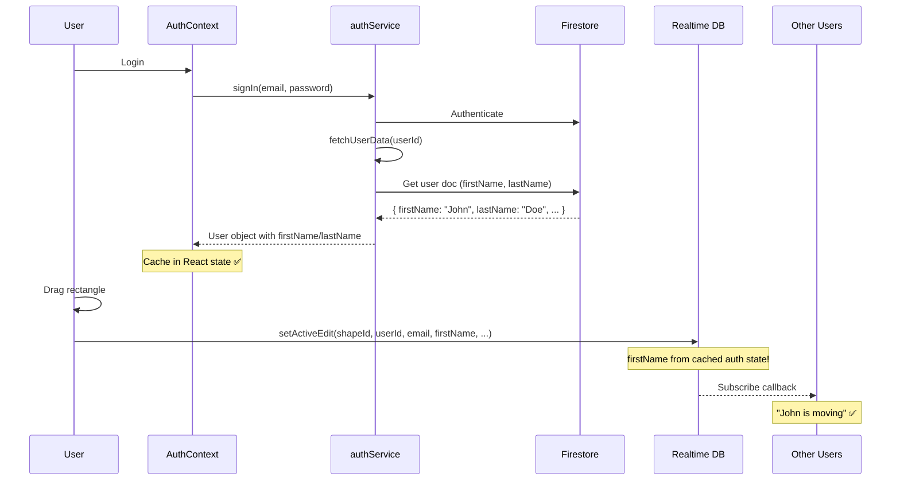

# Authentication & User Profile Architecture

## Overview
This document explains how user authentication and profile data (firstName/lastName) flow through the system, particularly in relation to real-time collaboration features.

## Architecture Decision: Hybrid Firestore + RTDB with Cached User Data

### The Challenge
Real-time collaboration indicators need to display user names (e.g., "John is moving") instantly, without blocking or adding latency to collaboration features.

### The Solution
**Cache user profile data at login, include it in real-time RTDB writes**



## Key Components

### 1. `authService.fetchUserData(userId)` Helper
**Location:** `src/services/auth.service.ts`

```typescript
async function fetchUserData(userId: string): Promise<User | null> {
  try {
    const userDoc = await getDoc(doc(db, 'users', userId));
    if (userDoc.exists()) {
      const userData = userDoc.data();
      return {
        userId,
        email: userData.email,
        firstName: userData.firstName || 'User',
        lastName: userData.lastName || '',
        createdAt: new Date(userData.createdAt)
      };
    }
    return null;
  } catch (error) {
    console.error('Error fetching user data:', error);
    return null;
  }
}
```

**Purpose:**
- Centralized user data fetching from Firestore
- Called **once** during login flow
- Easily mockable in tests
- Returns full User object with firstName/lastName

### 2. AuthContext Integration
**Location:** `src/context/AuthContext.tsx`

```typescript
useEffect(() => {
  const unsubscribe = authService.onAuthStateChange(async (firebaseUser) => {
    if (firebaseUser) {
      // Fetch full user profile (firstName/lastName)
      const userData = await authService.fetchUserData(firebaseUser.uid);
      if (userData) {
        setAuthState({ user: userData, loading: false, error: null });
        // ✅ firstName/lastName now cached in AuthContext state
      }
    }
  });
  return () => unsubscribe();
}, []);
```

**Key Points:**
- Async fetch happens **once at login**
- Runs before user can access canvas (during loading state)
- Cached in React state for entire session
- ~50-200ms Firestore read (acceptable at login)

### 3. Real-Time Collaboration Flow
**Location:** `src/services/activeEdits.service.ts`, `src/components/Canvas/Rectangle.tsx`

```typescript
// In Rectangle.tsx - when user starts dragging
const handleDragStart = () => {
  setActiveEdit(
    rectangle.id,
    user.userId,
    user.email,
    user.firstName,  // ✅ From cached auth state - NO Firestore lookup!
    'moving',
    getUserCursorColor(user.email)
  );
};

// In activeEdits.service.ts
export async function setActiveEdit(
  shapeId: string,
  userId: string,
  email: string,
  firstName: string,  // ✅ Already in memory
  action: EditAction,
  cursorColor: string
): Promise<void> {
  const editData: ActiveEdit = {
    userId,
    email,
    firstName,  // ✅ Written directly to RTDB
    action,
    cursorColor,
    startedAt: Date.now(),
  };
  await set(editRef, editData);  // ~50-100ms RTDB write
}
```

## Performance Analysis

| Action | Data Source | Latency | Frequency | Impact on Collaboration |
|--------|-------------|---------|-----------|------------------------|
| User logs in | Firestore (fetchUserData) | ~50-200ms | Once per session | ❌ None - happens before canvas access |
| User drags shape | Memory (authState.user.firstName) | ~0ms (cached) | Multiple/second | ✅ Zero latency |
| RTDB write (setActiveEdit) | RTDB | ~50-100ms | Per drag/resize/recolor | ✅ Real-time sync |
| Other users receive update | RTDB subscription | ~50-100ms | Per edit | ✅ Instant indicators |

## Why This Architecture Works

### ✅ Separation of Concerns
- **Firestore:** Persistent user profiles (firstName, lastName, email, createdAt)
- **AuthContext:** Session cache for user data
- **RTDB:** Real-time ephemeral collaboration state with firstName embedded

### ✅ No Blocking
- Async Firestore fetch at login doesn't block real-time collaboration
- firstName is **already in memory** when user starts editing
- RTDB writes are synchronous from the app's perspective

### ✅ Testability
- `fetchUserData()` is easily mocked in tests
- AuthContext doesn't need to dynamically import Firebase modules
- Clean separation between auth logic and real-time logic

### ✅ Scalability
- Only 1 Firestore read per user session
- RTDB handles high-frequency updates efficiently
- No cascading Firestore lookups during collaboration

## Data Flow Summary

```
Login Flow (Once per session):
┌─────────────┐
│ User logs in│
└──────┬──────┘
       │
       ├─> Firebase Auth (email/password)
       │
       ├─> authService.fetchUserData(userId)
       │   └─> Firestore: users/{userId}
       │       └─> { firstName, lastName, email, ... }
       │
       └─> AuthContext caches User object
           ✅ firstName/lastName in memory

Collaboration Flow (Multiple times per second):
┌──────────────┐
│ User edits   │
│ rectangle    │
└──────┬───────┘
       │
       ├─> Get firstName from authState.user (memory)
       │
       ├─> setActiveEdit(shapeId, userId, email, firstName, ...)
       │   └─> RTDB: activeEdits/default-canvas/{shapeId}
       │       └─> { userId, email, firstName, action, ... }
       │
       └─> Other users' subscriptions trigger
           └─> EditingIndicator: "John is moving" ✅
```

## Testing Considerations

### Mock Strategy
```typescript
// In tests: mock fetchUserData
mockedAuthService.fetchUserData = jest.fn().mockResolvedValue({
  userId: 'test-uid',
  email: 'test@example.com',
  firstName: 'Test',
  lastName: 'User',
  createdAt: new Date()
});
```

### Async Test Pattern
```typescript
// Tests must wait for async fetchUserData
it('should show canvas when authenticated', async () => {
  render(<App />);
  
  await waitFor(() => {
    expect(screen.getByText('CollabCanvas')).toBeInTheDocument();
  });
});
```

## Backward Compatibility

For existing users without firstName/lastName in Firestore:
- `fetchUserData()` returns null if user doc doesn't exist
- AuthContext falls back to: `{ firstName: 'User', lastName: '' }`
- EditingIndicator uses email username part if firstName === 'User'
- No breaking changes for existing accounts

## Future Considerations

### Profile Settings Page (Post-MVP)
- Allow users to update firstName/lastName
- Could trigger re-sync across active sessions
- Would need to propagate to active RTDB writes

### Real-Time Name Updates (Not Implemented)
- Currently, names are cached per session
- Changing name requires sign-out/sign-in to refresh
- Could add Firestore snapshot listener on user doc if needed

## Conclusion

**The async auth flow with `fetchUserData()` is optimal because:**
1. ✅ One-time Firestore fetch at login (before canvas access)
2. ✅ Zero latency during real-time collaboration (cached data)
3. ✅ Clean architecture (testable, maintainable, scalable)
4. ✅ No performance impact on 60 FPS rendering or real-time sync
5. ✅ Aligns with Firebase best practices (Firestore for persistent data, RTDB for ephemeral state)

The 50-200ms async fetch happens **once at login**, not during collaboration. Real-time indicators use cached firstName from memory, ensuring instant "John is moving" displays across all users.

