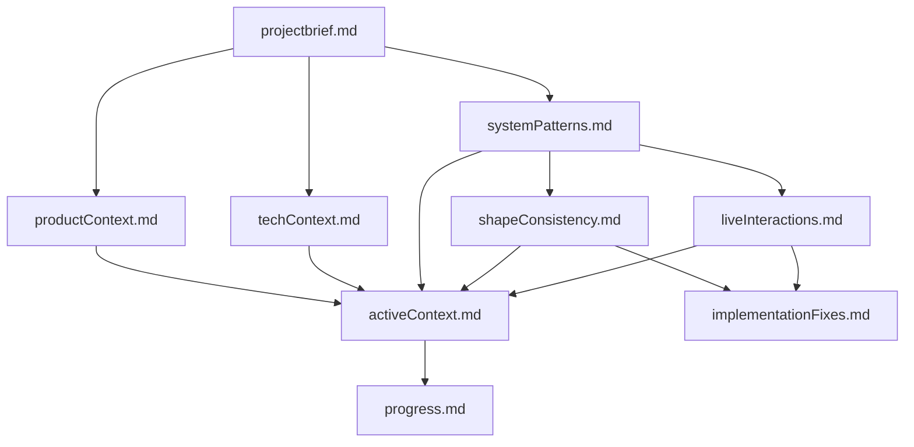

# CollabCanvas Memory Bank

## Overview
This memory bank contains comprehensive documentation of CollabCanvas's architecture, patterns, and implementation details. It serves as a knowledge repository for understanding the system's design decisions, consistency frameworks, and live interaction patterns.

## Memory Bank Structure

### Core Documentation
- **[projectbrief.md](./projectbrief.md)** - Project overview, mission, and success criteria
- **[productContext.md](./productContext.md)** - Product vision, user needs, and market context
- **[systemPatterns.md](./systemPatterns.md)** - Architectural patterns and design decisions
- **[shapeConsistency.md](./shapeConsistency.md)** - Shape component consistency framework
- **[liveInteractions.md](./liveInteractions.md)** - Real-time collaboration and live interaction patterns
- **[techContext.md](./techContext.md)** - Technical stack, tools, and development environment
- **[activeContext.md](./activeContext.md)** - Current project status and active development focus
- **[progress.md](./progress.md)** - Completion status and performance metrics
- **[implementationFixes.md](./implementationFixes.md)** - Critical fixes, lessons learned, and technical solutions

### AI Agent Documentation
- **[AI_AGENT_FINAL_SUMMARY.md](./AI_AGENT_FINAL_SUMMARY.md)** - ⭐ **START HERE** - Verified implementation with line counts, viewport awareness, and all features
- **[AI_AGENT_COMPLETE_STATE.md](./AI_AGENT_COMPLETE_STATE.md)** - Complete AI Agent implementation details, critical fixes, and deployment guide
- **[AI_Agent_PRD](./AI_Agent_PRD)** - Original product requirements document for AI agent
- **[EDITING_INDICATOR_OPTIMIZATION_SUMMARY.md](./EDITING_INDICATOR_OPTIMIZATION_SUMMARY.md)** - Recent performance optimizations and synchronization improvements
- **[LAYERS_PANEL_CRITICAL_FIXES_JANUARY_2025.md](./LAYERS_PANEL_CRITICAL_FIXES_JANUARY_2025.md)** - Critical fixes for layers panel functionality

### Deployment & Operations
- **[DEPLOYMENT_WORKFLOW.md](./DEPLOYMENT_WORKFLOW.md)** - ⭐ **ESSENTIAL** - Complete Git and Firebase deployment guide for staging and production

## Quick Reference

### Architecture Highlights
- **Hybrid Firebase**: Firestore (persistent) + RTDB (ephemeral) for optimal cost/performance
- **Optimistic Updates**: Local-first updates with "last write wins" conflict resolution
- **120 FPS Performance**: Ultra-smooth real-time collaboration with optimized updates
- **Shape Consistency**: Standardized patterns across all shape components
- **Perfect Synchronization**: Editing indicators move in perfect sync with shapes

### Key Patterns
- **Live Position Streaming**: 120 FPS real-time position updates during interactions
- **Active Edit Tracking**: Visual indicators for simultaneous editing with perfect synchronization
- **Conflict Resolution**: Visual feedback with "last write wins" logic
- **Performance Optimization**: Memoization, throttling, and efficient subscriptions
- **Z-Index Management**: Proper layer hierarchy ensuring indicators are always visible

### Current Status
- **Professional-Grade Tool**: Fully functional real-time collaborative design tool
- **AI Agent**: ✅ **Fully operational** - Natural language interface with 15+ commands (~100ms simple, <5s complex)
- **Performance**: 250 FPS with 500+ shapes and 5+ users
- **Testing**: 21 test files with comprehensive coverage
- **Deployment**: Publicly accessible on Firebase Hosting, AI Agent deployed on staging
- **Feature Complete**: All major design tool features + AI natural language interface
- **Recent Completions**: AI Agent (15+ operations, 6x performance optimization), copy/paste, undo/redo, color picker, layers panel, keyboard shortcuts

## Usage Guidelines

### For New Developers
1. Start with [projectbrief.md](./projectbrief.md) for project overview
2. Read [productContext.md](./productContext.md) for product vision and user needs
3. Study [systemPatterns.md](./systemPatterns.md) for architectural understanding
4. Review [shapeConsistency.md](./shapeConsistency.md) for component patterns
5. Study [liveInteractions.md](./liveInteractions.md) for collaboration features
6. Read [AI_AGENT_COMPLETE_STATE.md](./AI_AGENT_COMPLETE_STATE.md) for AI agent implementation
7. **IMPORTANT**: Review [DEPLOYMENT_WORKFLOW.md](./DEPLOYMENT_WORKFLOW.md) before deploying to staging or production

### For AI Assistants
1. Read all memory bank files to understand the system
2. Focus on [activeContext.md](./activeContext.md) for current status
3. Use [progress.md](./progress.md) for completion tracking
4. Reference [techContext.md](./techContext.md) for technical details

### For Maintenance
1. Update [activeContext.md](./activeContext.md) when status changes
2. Update [progress.md](./progress.md) when features are completed
3. Update [systemPatterns.md](./systemPatterns.md) when architecture evolves
4. Keep all files synchronized with codebase changes

## File Relationships

## Maintenance Notes

### When to Update
- **After major features**: Update progress.md and activeContext.md
- **After architectural changes**: Update systemPatterns.md
- **After new patterns**: Update shapeConsistency.md or liveInteractions.md
- **After tech changes**: Update techContext.md

### Quality Standards
- **Accuracy**: Keep documentation synchronized with codebase
- **Completeness**: Cover all major architectural decisions
- **Clarity**: Use clear, concise language with examples
- **Consistency**: Maintain consistent formatting and structure

## Contact and Support

For questions about this memory bank or CollabCanvas architecture:
- Review the relevant documentation files
- Check the activeContext.md for current status
- Refer to progress.md for completion tracking
- Use systemPatterns.md for architectural guidance

This memory bank is maintained as part of the CollabCanvas project and should be updated regularly to reflect the current state of the system.
